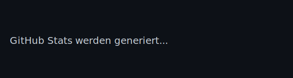
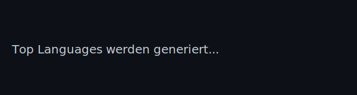

<!-- Profile README for: MartinKuntzschDevOps -->

  

  <b>Ich entwickle stabile Systeme: von Code bis Deployment – sauber, nachvollziehbar, reproduzierbar. Zusätzlich betreibe ich eigene Server‑Infrastrukturen (API‑, Datenbank‑, Cloud‑ und Git‑Server) sowie Webhosting mit MVC, TYPO3 und WordPress.</b> 

  
  
  

---

##  Über mich

- Clean Code, reproduzierbare Deployments, auditierbare Prozesse  
- DevOps-Mindset: Automatisierung, CI/CD, Monitoring  
- Dokumentierte Setups, klare Architekturentscheidungen  
- Aktiv in TYPO3, PHP/MVC, WPF/.NET, WordPress-Plugins und Infrastruktur  

---

##  Mein Tech Stack

### Web & Backend

  
  
  
  
  
  
  
  

### Datenbanken

  
  

### Desktop & .NET

  
  
  

### DevOps & Infrastruktur

  
  
  
  
  

---

##  GitHub Stats

  
  

<!-- Ende -->
