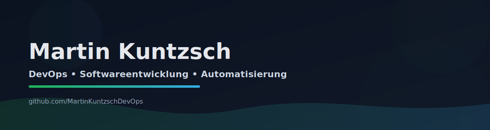

<!-- Profile README for: MartinKuntzschDevOps -->

  

  <b>Ich entwickle stabile Systeme: von Code bis Deployment – sauber, nachvollziehbar, reproduzierbar. Zusätzlich betreibe ich eigene Server‑Infrastrukturen (API‑, Datenbank‑, Cloud‑ und Git‑Server) sowie Webhosting mit MVC, TYPO3 und WordPress.</b> 

  
  
  

---

## Über mich
- Fachinformatiker Anwendungsentwicklung (Schwerpunkt: praxisnahe Projekte)
- Fokus: **DevOps mindset** – Automatisierung, Deployments, Monitoring, saubere Prozesse
- Ich mag: klare Strukturen, wartbaren Code, dokumentierte Setups
- Aktuell: TYPO3, PHP/MVC, WPF/.NET, WordPress-Plugin-Entwicklung + Infrastruktur-Themen

---

## Tech Stack (Auswahl)
**Backend / Web**
- PHP, MVC, Smarty, TYPO3, WordPress
- SQL (z. B. SQLite/MySQL), REST-Grundlagen

**Desktop**
- C# / .NET, WPF

**DevOps / Ops**
- Linux, Docker (Compose), CI/CD (GitHub Actions)
- Monitoring/Logging (Aufbau & Interesse: Prometheus/Grafana/Logs)

---

## Featured Projects (bitte ersetzen/ergänzen)
> Tipp: Verlinke hier 3–6 Repos, die du später auch „pinnst“.

- 🔹 **Projekt 1:** Kurzbeschreibung (Link)
- 🔹 **Projekt 2:** Kurzbeschreibung (Link)
- 🔹 **Projekt 3:** Kurzbeschreibung (Link)

---

## Was du hier erwarten kannst
- Clean Code + nachvollziehbare Commits
- Dokumentation (README, Setup, Entscheidungen)
- Reproduzierbare Builds (CI/CD, Container, Scripts)
- Fokus auf Praxis & Umsetzbarkeit

---

## GitHub Stats (optional)

  
  

<!-- Ende -->
